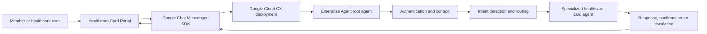
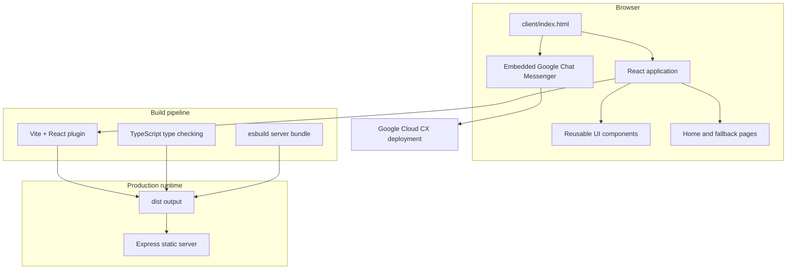
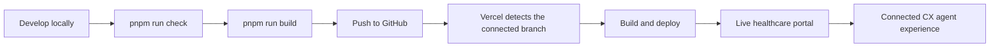

# Healthcare Card Portal

> A welcoming, production-minded frontend for the [Enterprise Agent](https://github.com/Samarssj/Enterprise-Agent)—an AI-powered healthcare card support experience built with Google Cloud CX Agent Studio.

[](https://react.dev/)
[](https://vite.dev/)
[](https://tailwindcss.com/)
[](https://www.typescriptlang.org/)
[](https://vercel.com/)

## Overview

Healthcare Card Portal is the polished web experience that brings the Enterprise Agent to members and healthcare users. It combines a clear, responsive healthcare landing page with an embedded conversational assistant, creating a single place where users can discover services, ask questions, upload files, and use audio input when interacting with the agent.

The portal is intentionally focused on **experience and presentation**. The business reasoning, authentication flows, intent routing, specialized healthcare-card agents, and operational workflows live in the companion [Enterprise-Agent repository](https://github.com/Samarssj/Enterprise-Agent). The two repositories work together as a frontend-and-agent system:

| Layer | Repository | Responsibility |
| --- | --- | --- |
| Experience layer | **Healthcare Card Portal** | Responsive website, branded content, navigation, embedded chat surface, audio/file interaction controls, and deployment shell. |
| Intelligence layer | **[Enterprise-Agent](https://github.com/Samarssj/Enterprise-Agent)** | Root-agent orchestration, authentication-first conversations, intent detection, specialized sub-agents, healthcare card workflows, tools, and service integrations. |
| Integration boundary | **Google Chat Messenger SDK + CX deployment** | Connects the portal’s chat UI to the deployed Google Cloud CX conversational agent. |

## Why this project exists

Healthcare card support often involves requests that are simple to state but operationally different: creating a card, replacing a lost card, modifying member details, tracking a request, or resolving access problems. The portal gives those conversations a professional digital front door while the Enterprise Agent coordinates the underlying support journey.

The result is a consistent member experience that is easier to discover, easier to use, and ready to grow as the agent gains additional workflows.

## Connected to the Enterprise Agent

The portal does not duplicate the agent’s business logic. Instead, it provides the user-facing surface for the agent that is defined and configured in the companion repository.

At runtime, the connection follows this path:



The integration is configured in [`client/index.html`](./client/index.html). The page loads the Google Chat Messenger SDK, registers the CX deployment context, and renders the `<chat-messenger>` component. The chat container is configured with the portal’s title and supports **file uploads** and **audio input**, allowing the frontend to expose the interaction modes supported by the agent.

The Enterprise Agent repository supplies the conversational intelligence behind that surface. Its documented architecture includes a root agent, authentication, intent-based routing, and specialized flows for ID card creation, lost-card replacement, ID card modification, status tracking, and access issues. See the [Enterprise Agent README](https://github.com/Samarssj/Enterprise-Agent) for the agent-side architecture and workflow definitions.

## User journey

The portal is designed around a simple, low-friction journey:

1. A user lands on the healthcare portal and understands the available support services.
2. The user opens the floating conversational assistant from the bottom-right corner.
3. The Google CX-powered agent welcomes the user and identifies the request.
4. The Enterprise Agent authenticates the user when the workflow requires member context.
5. The root agent routes the conversation to the appropriate specialized healthcare-card flow.
6. The agent returns guidance, captures the required information, confirms the request, or escalates when necessary.
7. The user can start a new session, collapse the assistant, upload a file, or provide audio input directly from the portal.

## Architecture

The application follows a lightweight frontend architecture with a small production server for static delivery and client-side routing.



### Frontend composition

The React application is bootstrapped from [`client/src/main.tsx`](./client/src/main.tsx) and composed in [`client/src/App.tsx`](./client/src/App.tsx). The application shell provides an error boundary, theme provider, tooltip support, notifications, and route handling through Wouter.

The primary page is [`client/src/pages/Home.tsx`](./client/src/pages/Home.tsx), which brings together the header, hero section, services section, feature highlights, and footer. Shared components under [`client/src/components`](./client/src/components) keep the visual system modular and make future page additions easier.

### Routing and resilience

Wouter provides lightweight client-side routing for the home page and the not-found path. An error boundary protects the user experience from uncaught rendering failures, while the Express fallback serves the application shell for client-side routes in production.

### Styling and interaction

Tailwind CSS provides the utility-first styling foundation, with Radix UI primitives supporting accessible interaction patterns. Lucide icons, Framer Motion, responsive layout utilities, and the project’s theme context contribute to a polished, responsive interface across desktop and mobile breakpoints.

## Technology stack

| Area | Technology | How it is used |
| --- | --- | --- |
| UI framework | React 19 | Component-based application and page composition. |
| Language | TypeScript 5.6 | Typed React components, configuration, and server code. |
| Frontend tooling | Vite 7 | Fast local development server and production client bundling. |
| Styling | Tailwind CSS 4 | Responsive layout, design tokens, and utility-based styling. |
| Accessible primitives | Radix UI | Headless components for common interaction patterns. |
| Motion and icons | Framer Motion, Lucide React | Subtle transitions and consistent interface iconography. |
| Routing | Wouter | Lightweight client-side route handling. |
| Notifications | Sonner | Toast feedback and user-facing status messages. |
| Server runtime | Node.js + Express | Static production delivery and SPA fallback routing. |
| Agent experience | Google Chat Messenger SDK | Embedded conversational UI connected to the CX deployment. |
| Agent platform | Google Cloud CX Agent Studio | Conversational intelligence delivered by the Enterprise Agent. |
| Deployment | Vercel | Continuous deployment from the connected GitHub repository. |

## Repository structure

```text
healthcare-card-portal/
├── client/
│   ├── index.html              # HTML shell and Google Chat Messenger integration
│   ├── public/                 # Static public assets
│   └── src/
│       ├── components/         # Shared layout, content, and UI components
│       ├── contexts/           # Theme and application contexts
│       ├── lib/                # Client-side utilities and helpers
│       ├── pages/               # Route-level page components
│       ├── App.tsx             # Application shell and routing
│       ├── const.ts            # Client configuration constants
│       └── main.tsx             # React entry point
├── server/
│   └── index.ts                # Express static server and SPA fallback
├── shared/
│   └── const.ts                # Shared constants
├── patches/                    # Dependency patches
├── DEPLOYMENT.md               # Vercel deployment notes
├── package.json                # Scripts and dependencies
├── pnpm-lock.yaml              # Locked dependency graph
├── tsconfig.json               # TypeScript configuration
├── vercel.json                 # Vercel configuration
└── vite.config.ts              # Vite configuration
```

## Local development

### Prerequisites

Use Node.js 18 or later and pnpm. The repository declares pnpm as its package manager, so using pnpm keeps local installations aligned with the lockfile and Vercel build environment.

### Install and run

```bash
git clone https://github.com/Samarssj/healthcare-card-portal.git
cd healthcare-card-portal
pnpm install
pnpm run dev
```

The Vite development server is available at `http://localhost:5173`.

### Validate and build

```bash
# Type-check the project
pnpm run check

# Build the client and bundled production server
pnpm run build

# Preview the Vite production output
pnpm run preview

# Run the bundled server in production mode
pnpm run start
```

## Configuration and integration notes

The chat deployment context is currently configured in [`client/index.html`](./client/index.html), where the Google Chat Messenger SDK is loaded and registered with the CX deployment. If the agent deployment changes, update that integration configuration and verify the chat experience in a deployed environment.

The repository also supports frontend environment variables for optional runtime integrations. Keep environment-specific values out of source control and configure them locally in a `.env` file or in the Vercel project settings.

| Variable | Purpose |
| --- | --- |
| `VITE_FRONTEND_FORGE_API_KEY` | Client-side key used by the map component when map functionality is enabled. |
| `VITE_FRONTEND_FORGE_API_URL` | Frontend Forge API base URL used by the map component. |
| `VITE_OAUTH_PORTAL_URL` | OAuth portal URL used by the shared client configuration. |
| `VITE_APP_ID` | Application identifier used to construct the OAuth callback configuration. |
| `VITE_ANALYTICS_ENDPOINT` | Optional analytics endpoint documented in the deployment guide. |
| `VITE_ANALYTICS_WEBSITE_ID` | Optional analytics site identifier documented in the deployment guide. |

> Never commit real credentials, deployment secrets, or private API keys. Use Vercel environment settings for production values.

## Delivery workflow

The project is designed for a straightforward GitHub-to-Vercel workflow:



Every push to the connected GitHub branch can trigger a fresh Vercel build. Vercel installs dependencies with pnpm, runs the production build, and publishes the resulting application when the build succeeds. The live portal then continues to use the configured Google CX deployment as its conversational backend.

For more deployment-specific guidance, see [`DEPLOYMENT.md`](./DEPLOYMENT.md).

## Companion project

The intelligence layer for this frontend lives in the companion repository:

**[Samarssj/Enterprise-Agent](https://github.com/Samarssj/Enterprise-Agent)**

That repository contains the CX Agent Studio project documentation, multi-agent architecture, healthcare-card use cases, orchestration flows, tools, and future integration roadmap. Keep the two repositories conceptually aligned: changes to the agent’s deployment or conversational contract should be reflected in the portal’s integration configuration and user-facing copy.

## Roadmap

The portal is well positioned for future enhancements such as authenticated member areas, richer service-status views, analytics, multilingual content, voice-first interactions, and deeper handoff experiences. These additions can be introduced incrementally while preserving the current separation between the portal’s presentation layer and the Enterprise Agent’s conversational orchestration layer.

## Contributing

To contribute, create a focused branch, make the change, run the type-check and production build locally, and open a pull request with a clear description of the user-facing or integration impact.

```bash
git checkout -b feature/your-change
pnpm install
pnpm run check
pnpm run build
git add .
git commit -m "Describe your change"
git push origin feature/your-change
```

## License

This project is licensed under the MIT License. See the repository configuration and project history for additional context.

## References

1. [Enterprise Agent repository](https://github.com/Samarssj/Enterprise-Agent)
2. [Google Cloud CX Agent documentation](https://cloud.google.com/dialogflow/cx/docs)
3. [Google Chat Messenger documentation](https://cloud.google.com/customer-engagement-ai/conversational-agents/docs/conversational-agents)
4. [React documentation](https://react.dev/)
5. [Vite documentation](https://vite.dev/)
6. [Tailwind CSS documentation](https://tailwindcss.com/docs)
7. [Vercel documentation](https://vercel.com/docs)
